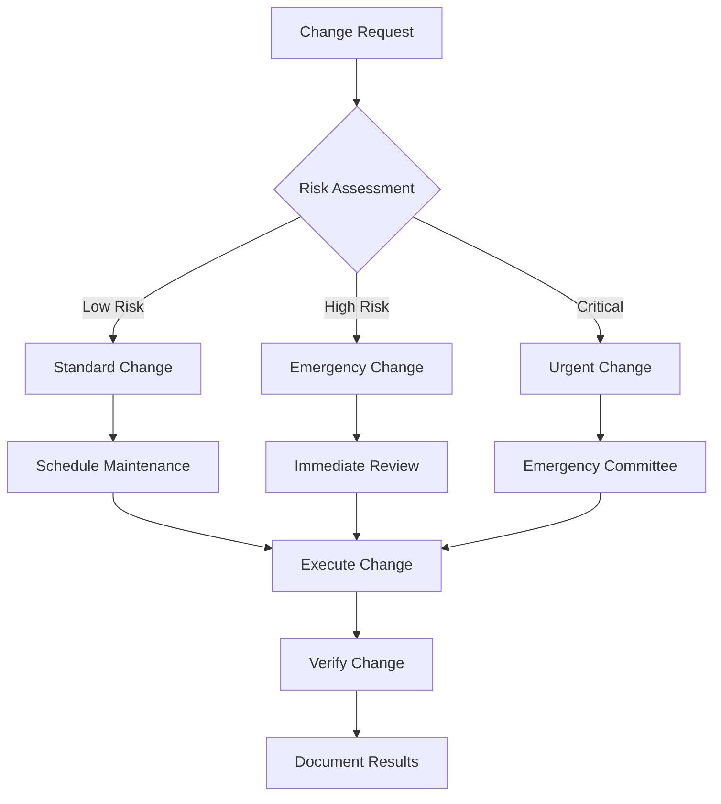

# System Maintenance Procedures

This document details maintenance procedures for our HIPAA-compliant system, building upon procedures in [Recovery Procedures](../recovery/PROCEDURES.md).

## Change Management

### 1. Change Request Process

```typescript
interface ChangeRequest {
  id: string
  type: 'SECURITY' | 'PERFORMANCE' | 'FEATURE' | 'CONFIGURATION'
  priority: 'CRITICAL' | 'HIGH' | 'MEDIUM' | 'LOW'
  impact: {
    components: string[]
    services: string[]
    tenants: string[]
  }
  schedule: {
    proposed: Date
    window: number // minutes
    blackout: boolean
  }
  approvals: Approval[]
}

interface Approval {
  role: 'SECURITY' | 'ENGINEERING' | 'OPERATIONS' | 'COMPLIANCE'
  status: 'PENDING' | 'APPROVED' | 'REJECTED'
  comments: string
  timestamp: Date
}
```

### Change Flow



## Component Updates

### 1. Database Maintenance

```typescript
interface DatabaseMaintenance {
  type: 'VACUUM' | 'REINDEX' | 'ANALYZE' | 'UPGRADE'
  impact: 'HIGH' | 'MEDIUM' | 'LOW'
  requiresDowntime: boolean
  steps: MaintenanceStep[]
}

const DB_MAINTENANCE_PROCEDURES = {
  'VACUUM': {
    preChecks: [
      'DISK_SPACE',
      'CONNECTIONS',
      'LOCKS'
    ],
    execution: async (config: MaintenanceConfig) => {
      // 1. Notify stakeholders
      await notifyMaintenance(config)
      
      // 2. Execute vacuum
      for (const table of config.tables) {
        await prisma.$executeRaw`
          VACUUM ANALYZE ${table} 
        `
      }
      
      // 3. Verify results
      await verifyTableStats(config.tables)
    }
  }
}
```

### 2. Security Updates

```typescript
interface SecurityUpdate {
  component: string
  version: {
    current: string
    target: string
  }
  patches: SecurityPatch[]
  verificationSteps: VerificationStep[]
}

async function applySecurityUpdates(
  updates: SecurityUpdate[]
): Promise<UpdateResult[]> {
  const results: UpdateResult[] = []
  
  for (const update of updates) {
    try {
      // 1. Backup current state
      await backupComponent(update.component)
      
      // 2. Apply patches
      for (const patch of update.patches) {
        await applyPatch(patch)
      }
      
      // 3. Verify update
      const verification = await verifyUpdate(update)
      results.push({
        component: update.component,
        status: verification.passed ? 'SUCCESS' : 'FAILED',
        details: verification
      })
    } catch (error) {
      await rollbackUpdate(update)
      results.push({
        component: update.component,
        status: 'FAILED',
        error
      })
    }
  }
  
  return results
}
```

## Performance Tuning

### 1. Database Optimization

```typescript
interface DatabaseOptimization {
  target: {
    component: string
    metric: string
    current: number
    desired: number
  }
  steps: OptimizationStep[]
  validation: ValidationCheck[]
}

const OPTIMIZATION_PROCEDURES = {
  'QUERY_PERFORMANCE': {
    analysis: async () => {
      const slowQueries = await prisma.$queryRaw`
        SELECT * FROM pg_stat_statements
        WHERE mean_time > 100
        ORDER BY mean_time DESC
        LIMIT 10
      `
      return analyzeQueryPatterns(slowQueries)
    },
    optimization: async (patterns: QueryPattern[]) => {
      for (const pattern of patterns) {
        await optimizeQuery(pattern)
      }
    },
    verification: async () => {
      return await validateQueryPerformance()
    }
  }
}
```

### 2. System Tuning

```typescript
interface SystemTuning {
  resource: 'CPU' | 'MEMORY' | 'DISK' | 'NETWORK'
  metrics: {
    current: ResourceMetrics
    target: ResourceMetrics
  }
  adjustments: TuningAdjustment[]
}

async function tuneSystem(
  config: SystemTuning
): Promise<TuningResult> {
  // 1. Collect baseline metrics
  const baseline = await collectMetrics(config.resource)
  
  // 2. Apply adjustments
  for (const adjustment of config.adjustments) {
    await applyTuning(adjustment)
    
    // Wait for stabilization
    await waitForStabilization()
    
    // Collect new metrics
    const current = await collectMetrics(config.resource)
    
    // Verify improvement
    if (!isImproved(baseline, current)) {
      await rollbackTuning(adjustment)
    }
  }
  
  // 3. Final verification
  return await verifyTuning(config)
}
```

## Configuration Management

### 1. Configuration Updates

```typescript
interface ConfigurationChange {
  component: string
  parameter: string
  currentValue: any
  newValue: any
  validation: ValidationRule[]
  rollback: RollbackProcedure
}

async function updateConfiguration(
  changes: ConfigurationChange[]
): Promise<void> {
  const transaction = await beginConfigTransaction()
  
  try {
    for (const change of changes) {
      // 1. Validate new value
      await validateConfiguration(change)
      
      // 2. Apply change
      await applyConfiguration(change)
      
      // 3. Verify change
      await verifyConfiguration(change)
    }
    
    await commitConfigTransaction(transaction)
  } catch (error) {
    await rollbackConfigTransaction(transaction)
    throw error
  }
}
```

### 2. Configuration Validation

```typescript
interface ConfigValidation {
  rules: ValidationRule[]
  dependencies: string[]
  constraints: ConfigConstraint[]
}

const CONFIG_VALIDATION: Record<string, ConfigValidation> = {
  'DATABASE': {
    rules: [
      {
        parameter: 'max_connections',
        validate: (value: number) => value >= 100 && value <= 1000
      },
      {
        parameter: 'shared_buffers',
        validate: (value: string) => parseMemoryValue(value) >= 1024
      }
    ],
    dependencies: ['SYSTEM_MEMORY', 'CONCURRENT_USERS'],
    constraints: [
      'TOTAL_MEMORY_LIMIT',
      'PERFORMANCE_REQUIREMENTS'
    ]
  }
}
```

## Maintenance Windows

### 1. Scheduling

```typescript
interface MaintenanceWindow {
  id: string
  type: 'ROUTINE' | 'EMERGENCY'
  schedule: {
    start: Date
    duration: number
    timezone: string
  }
  notifications: {
    preStart: number[]  // minutes before
    stakeholders: string[]
  }
  procedures: MaintenanceProcedure[]
}

const MAINTENANCE_SCHEDULE = {
  'ROUTINE': {
    window: 'SUNDAY 01:00-05:00 UTC',
    blackoutDates: ['END_OF_MONTH', 'HOLIDAYS'],
    maxDuration: 240 // minutes
  },
  'EMERGENCY': {
    approvers: ['CTO', 'HEAD_OF_SECURITY'],
    maxDuration: 120,
    notification: 60 // minutes
  }
}
```

### 2. Execution Tracking

```typescript
interface MaintenanceExecution {
  windowId: string
  status: 'PLANNED' | 'IN_PROGRESS' | 'COMPLETED' | 'FAILED'
  timeline: {
    planned: Date
    started?: Date
    completed?: Date
  }
  procedures: {
    total: number
    completed: number
    failed: number
  }
  issues: MaintenanceIssue[]
}

async function trackMaintenance(
  execution: MaintenanceExecution
): Promise<void> {
  // 1. Update status
  await updateMaintenanceStatus(execution)
  
  // 2. Log progress
  await logMaintenanceProgress(execution)
  
  // 3. Notify stakeholders
  if (execution.issues.length > 0) {
    await notifyMaintenanceIssues(execution)
  }
  
  // 4. Generate report
  await generateMaintenanceReport(execution)
}
```

## Related Documentation
- [Recovery Procedures](../recovery/PROCEDURES.md)
- [Security Architecture](../security/ARCHITECTURE.md)
- [Operations Runbook](../runbooks/OPERATIONS.md) 