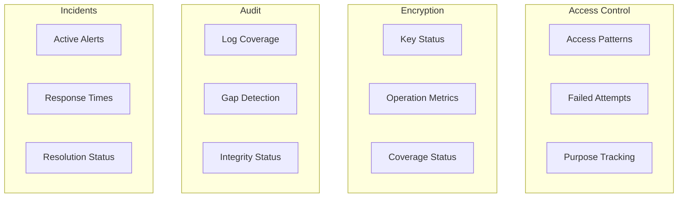
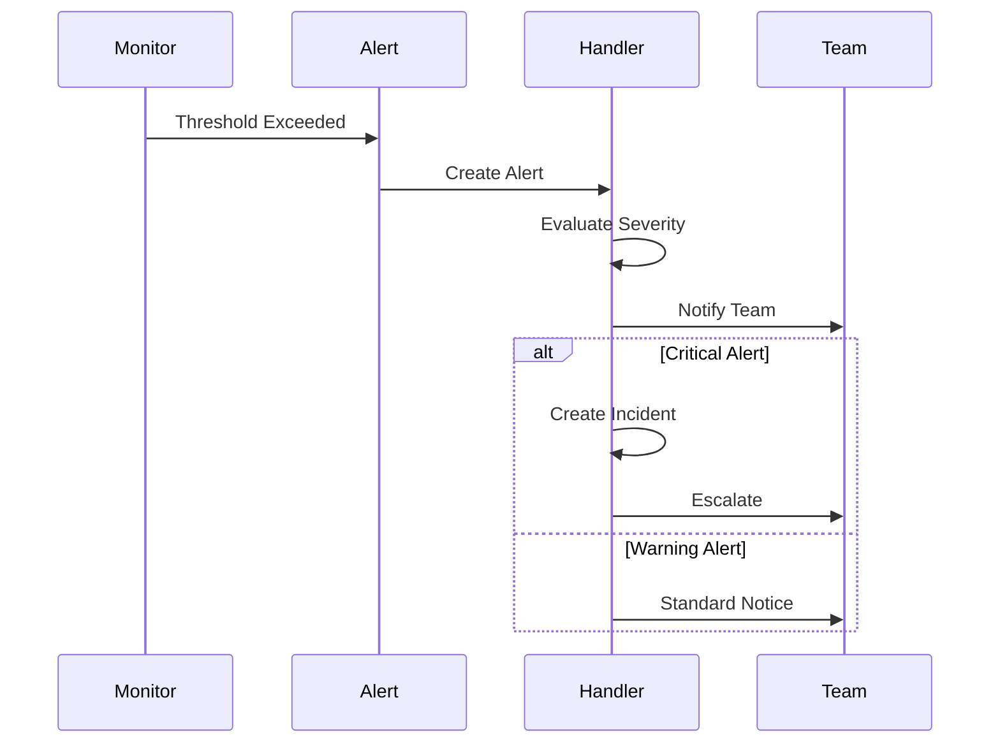

# Compliance Monitoring

This document details the compliance monitoring system that works alongside our [Security Reports](../reporting/SECURITY_REPORTS.md) system.

## Dashboard Components

### 1. Real-time Monitoring

```typescript
// lib/monitoring/dashboard.ts
interface ComplianceDashboard {
  components: {
    accessControl: AccessControlWidget
    encryption: EncryptionWidget
    audit: AuditWidget
    incidents: IncidentWidget
  }
  refresh: 'realtime' | number // milliseconds
  timeframe: TimeRange
}

interface DashboardWidget<T> {
  id: string
  title: string
  data: T
  thresholds: ThresholdConfig
  visualization: VisualizationType
  actions: WidgetAction[]
}
```

### Example Dashboard Layout



## Metric Definitions

### 1. Access Control Metrics

```typescript
interface AccessControlMetrics {
  realtime: {
    activeUsers: number
    failedAttempts: number
    mfaStatus: {
      enabled: number
      total: number
      percentage: number
    }
  }
  historical: {
    accessTrends: TimeSeriesData[]
    violationTrends: TimeSeriesData[]
    purposeDistribution: Record<string, number>
  }
  compliance: {
    rbacEffectiveness: number    // 0-100%
    purposeValidation: number    // 0-100%
    mfaCompliance: number        // 0-100%
  }
}
```

### 2. Encryption Metrics

```typescript
interface EncryptionMetrics {
  keyStatus: {
    active: number
    expiring: number
    rotationNeeded: number
  }
  operations: {
    totalEncrypted: number
    failedOperations: number
    averageLatency: number
  }
  coverage: {
    phiFields: number
    encryptedFields: number
    percentage: number
  }
}

// Visualization Example
const encryptionChart = {
  type: 'gauge',
  data: {
    labels: ['Coverage'],
    datasets: [{
      data: [98.5],
      backgroundColor: ['#00ff00'],
      thresholds: {
        warning: 95,
        critical: 90
      }
    }]
  }
}
```

## Alert Thresholds

### 1. Threshold Configuration

```typescript
// lib/monitoring/thresholds.ts
interface ComplianceThresholds {
  access: {
    failedAttempts: {
      warning: number    // per minute
      critical: number
      interval: number   // milliseconds
    }
    mfaCompliance: {
      minimum: number    // percentage
      target: number
    }
    purposeValidation: {
      required: string[]
      exceptions: string[]
    }
  }
  encryption: {
    keyAge: {
      warning: number    // days
      critical: number
    }
    coverage: {
      minimum: number    // percentage
      target: number
    }
    performance: {
      maxLatency: number // milliseconds
    }
  }
  audit: {
    coverage: {
      minimum: number    // percentage
      target: number
    }
    gapThreshold: number // milliseconds
    integrityChecks: string[]
  }
}

const DEFAULT_THRESHOLDS: ComplianceThresholds = {
  access: {
    failedAttempts: {
      warning: 5,
      critical: 10,
      interval: 60000
    },
    mfaCompliance: {
      minimum: 95,
      target: 100
    }
  }
  // ... other thresholds
}
```

### 2. Alert Rules

```typescript
interface AlertRule {
  id: string
  metric: string
  condition: AlertCondition
  threshold: number
  duration: number
  severity: 'LOW' | 'MEDIUM' | 'HIGH' | 'CRITICAL'
  actions: AlertAction[]
}

const COMPLIANCE_ALERTS: AlertRule[] = [
  {
    id: 'mfa-compliance',
    metric: 'mfa.compliance.percentage',
    condition: 'BELOW',
    threshold: 95,
    duration: 3600000, // 1 hour
    severity: 'HIGH',
    actions: ['NOTIFY_SECURITY', 'CREATE_INCIDENT']
  }
]
```

## Response Procedures

### 1. Alert Response Flow



### 2. Response Implementation

```typescript
// lib/monitoring/response.ts
interface AlertResponse {
  alert: Alert
  procedures: ResponseProcedure[]
  assignments: TeamAssignment[]
  timeline: ResponseTimeline
  status: ResponseStatus
}

async function handleComplianceAlert(
  alert: Alert
): Promise<AlertResponse> {
  // Create response record
  const response = await createAlertResponse(alert)
  
  // Assign team members
  await assignResponseTeam(response)
  
  // Execute immediate actions
  await executeResponseProcedures(response)
  
  // Track response
  await monitorResponse(response)
  
  return response
}
```

## Visualization Examples

### 1. Access Control Dashboard

```typescript
// components/monitoring/AccessControl.tsx
interface AccessControlProps {
  data: AccessControlMetrics
  timeframe: TimeRange
  onAlert: (alert: Alert) => void
}

const AccessControlDashboard: React.FC<AccessControlProps> = ({
  data,
  timeframe,
  onAlert
}) => {
  return (
    <DashboardGrid>
      <MetricCard
        title="MFA Compliance"
        value={data.realtime.mfaStatus.percentage}
        threshold={95}
        trend={data.historical.mfaTrend}
        visualization="gauge"
      />
      <LineChart
        title="Access Patterns"
        data={data.historical.accessTrends}
        annotations={data.historical.violationTrends}
      />
      <PieChart
        title="Purpose Distribution"
        data={data.historical.purposeDistribution}
        highlights={['TREATMENT', 'PAYMENT']}
      />
    </DashboardGrid>
  )
}
```

### 2. Compliance Trends

```typescript
// components/monitoring/ComplianceTrends.tsx
interface TrendVisualization {
  metric: string
  data: TimeSeriesData[]
  thresholds: ThresholdConfig
  annotations?: Annotation[]
}

const ComplianceTrendChart: React.FC<TrendVisualization> = ({
  metric,
  data,
  thresholds,
  annotations
}) => {
  const chartConfig = {
    type: 'line',
    data: {
      labels: data.map(d => d.timestamp),
      datasets: [{
        label: metric,
        data: data.map(d => d.value),
        borderColor: '#4CAF50',
        tension: 0.1
      }]
    },
    options: {
      plugins: {
        annotation: {
          annotations: [
            {
              type: 'line',
              yMin: thresholds.warning,
              yMax: thresholds.warning,
              borderColor: '#FFA500',
              borderWidth: 2
            },
            {
              type: 'line',
              yMin: thresholds.critical,
              yMax: thresholds.critical,
              borderColor: '#FF0000',
              borderWidth: 2
            }
          ]
        }
      }
    }
  }
  
  return <Chart config={chartConfig} />
}
```

## Related Documentation
- [Security Reports](../reporting/SECURITY_REPORTS.md)
- [Audit System](../security/AUDIT_SYSTEM.md)
- [Operations Runbook](../runbooks/OPERATIONS.md) 