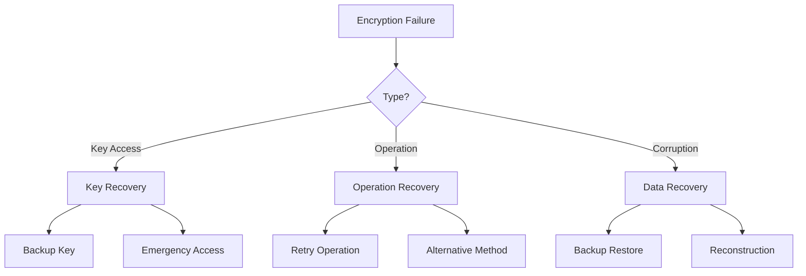

# Recovery Procedures

This document details recovery procedures for various system failures, building upon incident response procedures in [Incident Response](../security/INCIDENT_RESPONSE.md).

## Error Scenarios

### 1. Database Failures

```typescript
interface DatabaseFailure {
  type: 'CONNECTION' | 'REPLICATION' | 'CORRUPTION' | 'PERFORMANCE'
  severity: 'HIGH' | 'MEDIUM' | 'LOW'
  impact: {
    tenants: string[]
    services: string[]
    dataTypes: ('PHI' | 'AUDIT' | 'CONFIG')[]
  }
}

const DB_RECOVERY_PROCEDURES: Record<DatabaseFailure['type'], RecoveryStep[]> = {
  'CONNECTION': [
    {
      order: 1,
      action: 'VERIFY_CONNECTIVITY',
      validation: 'CONNECTION_CHECK',
      timeout: 30000,
      retry: { attempts: 3, backoff: 5000 }
    },
    {
      order: 2,
      action: 'RESTORE_CONNECTIONS',
      validation: 'POOL_STATUS',
      timeout: 60000,
      retry: { attempts: 2, backoff: 10000 }
    }
  ]
}
```

### 2. Encryption Failures



### 3. Tenant Context Issues

```typescript
interface TenantContextFailure {
  tenantId: string
  error: 'MISSING' | 'INVALID' | 'CORRUPTED'
  affectedOperations: string[]
  timestamp: Date
}

async function recoverTenantContext(
  failure: TenantContextFailure
): Promise<void> {
  // 1. Validate tenant
  const tenant = await validateTenant(failure.tenantId)
  
  // 2. Reset context
  await prisma.$executeRaw`
    SELECT reset_tenant_context(${tenant.id}::uuid)
  `
  
  // 3. Verify isolation
  await verifyTenantIsolation(tenant.id)
  
  // 4. Restore operations
  await restoreOperations(failure.affectedOperations)
}
```

## Recovery Steps

### 1. PHI Data Recovery

```typescript
interface PhiRecovery {
  recordId: string
  version: number
  encryptionKey: {
    id: string
    version: number
  }
  backupSource?: string
  validationRules: ValidationRule[]
}

async function recoverPhiData(
  config: PhiRecovery
): Promise<RecoveryResult> {
  const recoverySteps = [
    // 1. Retrieve backup
    async () => {
      const backup = await getPhiBackup(config.recordId, config.version)
      if (!backup) throw new Error('BACKUP_NOT_FOUND')
      return backup
    },
    
    // 2. Validate data
    async (backup: PhiBackup) => {
      const isValid = await validatePhiData(backup.data, config.validationRules)
      if (!isValid) throw new Error('VALIDATION_FAILED')
      return backup
    },
    
    // 3. Re-encrypt with current key
    async (backup: PhiBackup) => {
      return await reencryptPhiData(backup.data, config.encryptionKey)
    },
    
    // 4. Restore data
    async (encryptedData: EncryptedPhi) => {
      await restorePhiData(config.recordId, encryptedData)
      return true
    }
  ]

  return await executeRecoverySteps(recoverySteps)
}
```

### 2. Audit Trail Recovery

```typescript
interface AuditRecovery {
  startTime: Date
  endTime: Date
  resources: string[]
  reconstructionSources: ('LOGS' | 'BACKUPS' | 'SYSTEM_STATE')[]
}

async function reconstructAuditTrail(
  config: AuditRecovery
): Promise<void> {
  // 1. Gather available data
  const sources = await gatherRecoverySources(config)
  
  // 2. Identify gaps
  const gaps = await findAuditGaps(config.startTime, config.endTime)
  
  // 3. Reconstruct missing entries
  for (const gap of gaps) {
    await reconstructAuditEntries(gap, sources)
  }
  
  // 4. Validate reconstruction
  await validateAuditTrail(config.startTime, config.endTime)
}
```

## Data Validation

### 1. Integrity Checks

```typescript
interface IntegrityCheck {
  type: 'PHI' | 'AUDIT' | 'SYSTEM'
  checks: {
    schema: SchemaValidation
    references: ReferentialCheck
    encryption: EncryptionCheck
    consistency: ConsistencyCheck
  }
}

const VALIDATION_PROCEDURES = {
  'PHI': {
    requiredFields: ['patientId', 'encryptedData', 'keyVersion'],
    relationships: ['tenant', 'audit'],
    encryption: {
      algorithm: 'AES-256-GCM',
      keyValidation: true
    }
  }
}
```

### 2. Data Consistency

```typescript
async function validateDataConsistency(
  type: 'PHI' | 'AUDIT' | 'SYSTEM'
): Promise<ValidationResult> {
  const results: ValidationResult = {
    passed: true,
    checks: [],
    errors: []
  }

  // 1. Schema validation
  const schemaValid = await validateSchema(type)
  results.checks.push({
    name: 'SCHEMA',
    passed: schemaValid
  })

  // 2. Referential integrity
  const refsValid = await validateReferences(type)
  results.checks.push({
    name: 'REFERENCES',
    passed: refsValid
  })

  // 3. Business rules
  const rulesValid = await validateBusinessRules(type)
  results.checks.push({
    name: 'BUSINESS_RULES',
    passed: rulesValid
  })

  return results
}
```

## System Verification

### 1. Component Checks

```typescript
interface SystemCheck {
  component: string
  checks: VerificationCheck[]
  dependencies: string[]
  status: 'PASS' | 'FAIL' | 'WARN'
}

const SYSTEM_CHECKS: SystemCheck[] = [
  {
    component: 'DATABASE',
    checks: [
      'CONNECTION_POOL',
      'REPLICATION_LAG',
      'QUERY_PERFORMANCE'
    ],
    dependencies: [],
    status: 'PASS'
  },
  {
    component: 'ENCRYPTION',
    checks: [
      'KEY_ACCESS',
      'OPERATION_PERFORMANCE',
      'KEY_ROTATION'
    ],
    dependencies: ['DATABASE'],
    status: 'PASS'
  }
]
```

### 2. Health Verification

```typescript
async function verifySystemHealth(): Promise<HealthStatus> {
  const checks = await Promise.all([
    verifyDatabase(),
    verifyEncryption(),
    verifyAudit(),
    verifyTenantIsolation()
  ])

  return {
    healthy: checks.every(c => c.status === 'PASS'),
    components: checks,
    timestamp: new Date()
  }
}
```

## Rollback Procedures

### 1. Transaction Rollback

```typescript
interface RollbackPlan {
  steps: RollbackStep[]
  validation: ValidationStep[]
  compensation: CompensationAction[]
}

async function executeRollback(
  plan: RollbackPlan
): Promise<RollbackResult> {
  const results: StepResult[] = []
  
  for (const step of plan.steps.reverse()) {
    try {
      await executeRollbackStep(step)
      results.push({ step: step.id, status: 'SUCCESS' })
    } catch (error) {
      results.push({ step: step.id, status: 'FAILED', error })
      await executeCompensation(plan.compensation)
      break
    }
  }

  return {
    success: results.every(r => r.status === 'SUCCESS'),
    steps: results
  }
}
```

### 2. State Recovery

```typescript
interface StateRecovery {
  snapshot: SystemSnapshot
  verification: VerificationStep[]
  fallback: FallbackPlan
}

async function recoverSystemState(
  recovery: StateRecovery
): Promise<void> {
  // 1. Verify snapshot
  const snapshotValid = await verifySnapshot(recovery.snapshot)
  if (!snapshotValid) {
    throw new Error('INVALID_SNAPSHOT')
  }

  // 2. Apply snapshot
  await applySnapshot(recovery.snapshot)

  // 3. Verify state
  const verification = await verifySystemState(recovery.verification)
  if (!verification.passed) {
    await executeFallback(recovery.fallback)
  }
}
```

## Related Documentation
- [Incident Response](../security/INCIDENT_RESPONSE.md)
- [Operations Runbook](../runbooks/OPERATIONS.md)
- [Security Architecture](../security/ARCHITECTURE.md) 