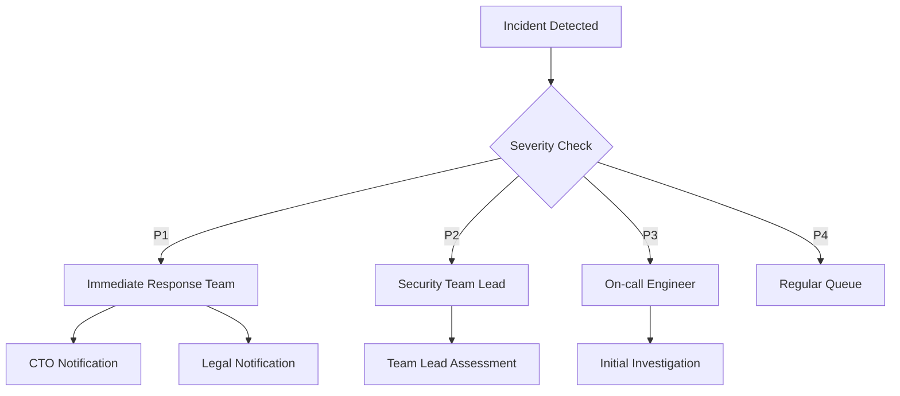

# Operations Runbooks

This document provides step-by-step procedures for common operational tasks and incidents.

## Performance Monitoring

### Daily Health Check

```bash
# 1. Check system metrics
$ npm run metrics:check

# Expected Output:
# ✓ RLS Overhead: < 50ms
# ✓ PHI Query Time: < 100ms
# ✓ Audit Write Time: < 10ms
```

#### Action Items
- If RLS overhead > 50ms: [RLS Optimization Guide](#rls-optimization)
- If PHI query time > 100ms: [PHI Performance Guide](#phi-performance)
- If audit writes > 10ms: [Audit Performance Guide](#audit-performance)

### Query Performance Analysis

```sql
-- Check RLS impact
SELECT * FROM monitor_rls_overhead()
WHERE avg_overhead_ms > 50
ORDER BY avg_overhead_ms DESC;

-- Check encryption overhead
SELECT * FROM monitor_encryption_performance()
WHERE duration_ms > 100
ORDER BY duration_ms DESC;
```

#### Optimization Steps
1. Review execution plans
2. Check index usage
3. Analyze query patterns
4. Adjust RLS policies if needed

## Security Metrics Collection

### Key Metrics Dashboard

```typescript
interface SecurityMetrics {
  accessPatterns: {
    totalRequests: number
    failedAttempts: number
    unusualPatterns: number
  }
  encryption: {
    keyAge: number
    failedOperations: number
    reEncryptionStatus: string
  }
  audit: {
    coverage: number
    gaps: number
    integrityIssues: number
  }
}
```

### Collection Procedures

1. **Hourly Metrics**
   ```bash
   # Collect and store metrics
   $ npm run security:metrics:collect
   
   # Verify collection
   $ npm run security:metrics:verify
   ```

2. **Daily Analysis**
   ```bash
   # Generate daily report
   $ npm run security:report:daily
   
   # Check for anomalies
   $ npm run security:anomaly:check
   ```

## Alert Handling

### Alert Levels

| Level | Response Time | Escalation Path |
|-------|--------------|-----------------|
| P1    | 15 minutes   | Security Team → CTO |
| P2    | 1 hour       | Security Team → Lead |
| P3    | 4 hours      | On-call Engineer |
| P4    | 24 hours     | Regular queue |

### Alert Response Procedure

1. **Initial Assessment**
   ```typescript
   interface AlertResponse {
     alertId: string
     severity: 'P1' | 'P2' | 'P3' | 'P4'
     initialAssessment: {
       impact: string[]
       affectedSystems: string[]
       immediateActions: string[]
     }
   }
   ```

2. **Immediate Actions**
   - Acknowledge alert
   - Assess scope
   - Take containment actions
   - Log initial response

3. **Investigation**
   ```bash
   # Gather context
   $ npm run alert:context ${alertId}
   
   # Check related events
   $ npm run alert:related ${alertId}
   
   # Generate timeline
   $ npm run alert:timeline ${alertId}
   ```

## Incident Response

### Security Incident Procedure

1. **Initial Response**
   ```bash
   # Create incident record
   $ npm run incident:create \
     --type ${incidentType} \
     --severity ${severity} \
     --description "${description}"
   
   # Initiate response
   $ npm run incident:respond ${incidentId}
   ```

2. **Containment Actions**
   ```typescript
   async function containIncident(incidentId: string): Promise<void> {
     // Isolate affected systems
     await isolateAffectedSystems(incidentId)
     
     // Block suspicious activity
     await blockSuspiciousTraffic(incidentId)
     
     // Preserve evidence
     await preserveEvidence(incidentId)
   }
   ```

3. **Investigation Steps**
   ```bash
   # Collect logs
   $ npm run incident:logs:collect ${incidentId}
   
   # Analyze traffic patterns
   $ npm run incident:traffic:analyze ${incidentId}
   
   # Check system integrity
   $ npm run incident:integrity:check ${incidentId}
   ```

### Escalation Procedures



## Troubleshooting Guides

### RLS Optimization

1. Check policy performance:
   ```sql
   EXPLAIN ANALYZE
   SELECT * FROM monitor_rls_performance();
   ```

2. Analyze index usage:
   ```sql
   SELECT * FROM pg_stat_user_indexes
   WHERE idx_scan = 0;
   ```

3. Review tenant context:
   ```sql
   SELECT current_setting('app.current_tenant_id', true);
   ```

### PHI Performance

1. Check encryption metrics:
   ```bash
   $ npm run phi:metrics
   ```

2. Analyze query patterns:
   ```sql
   SELECT * FROM phi_access_patterns
   WHERE duration_ms > 100;
   ```

3. Verify index health:
   ```sql
   REINDEX TABLE "Deal";
   ANALYZE "Deal";
   ```

### Audit Performance

1. Check write latency:
   ```sql
   SELECT avg(extract(epoch from duration))
   FROM audit_write_metrics
   WHERE timestamp > now() - interval '1 hour';
   ```

2. Monitor buffer usage:
   ```bash
   $ npm run audit:buffer:status
   ```

3. Verify async processing:
   ```bash
   $ npm run audit:async:health
   ```

## Recovery Procedures

### System Recovery Checklist

- [ ] Verify system integrity
- [ ] Check data consistency
- [ ] Validate tenant isolation
- [ ] Confirm audit completeness
- [ ] Test security controls
- [ ] Monitor performance
- [ ] Update documentation

### Recovery Commands

```bash
# Verify system state
$ npm run system:verify

# Check data integrity
$ npm run data:verify

# Test security controls
$ npm run security:test

# Generate recovery report
$ npm run recovery:report
```

## Related Documentation
- [Security Architecture](../security/ARCHITECTURE.md)
- [Audit System](../security/AUDIT_SYSTEM.md)
- [PHI Handling](../security/PHI_HANDLING.md) 