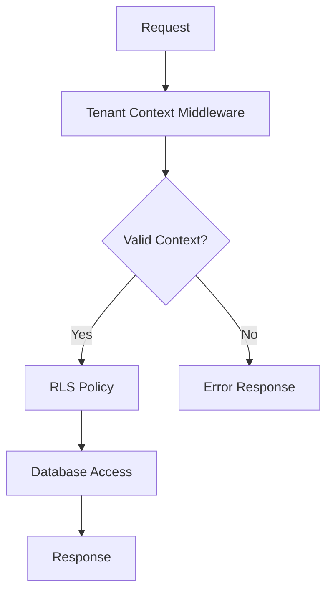
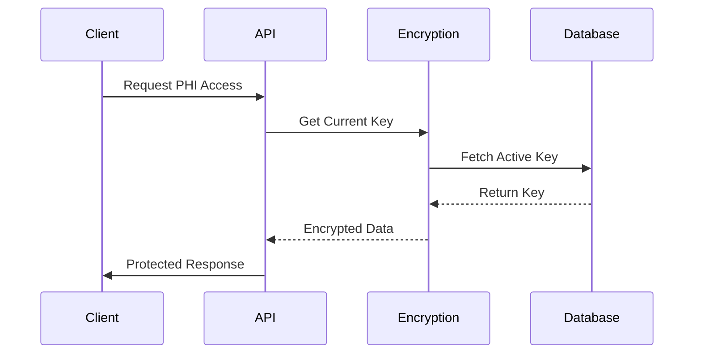
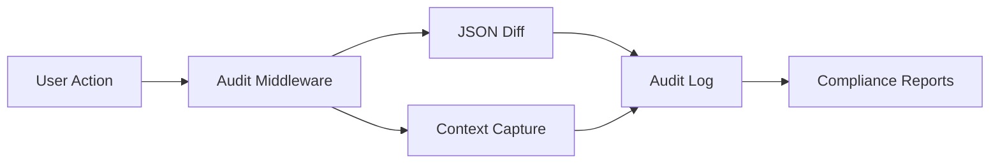
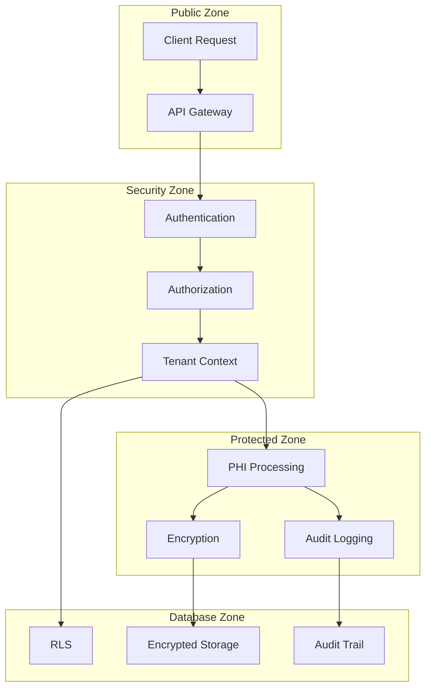
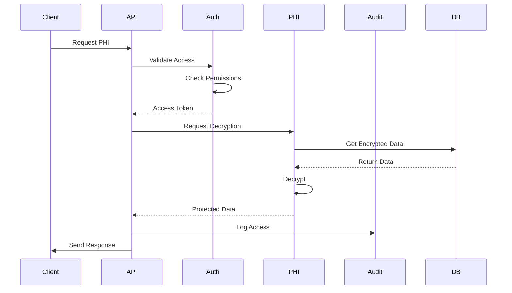
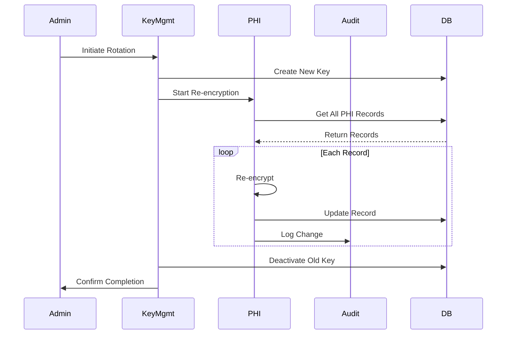
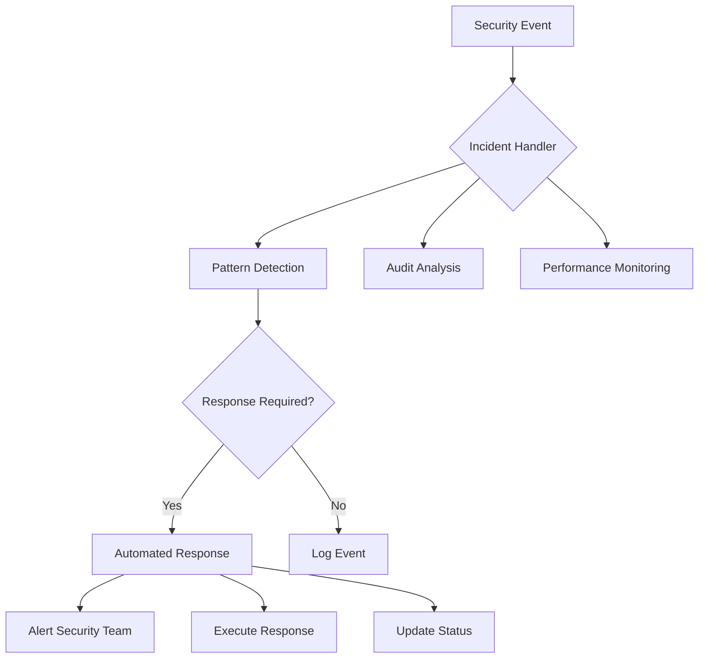
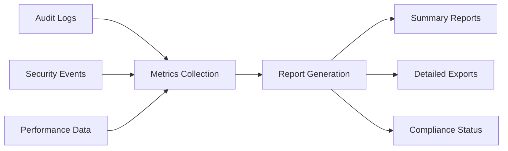

# Security Architecture Documentation

## Overview
This document describes the security architecture of our HIPAA-compliant, multi-tenant healthcare system. It outlines the key components, their interactions, and security boundaries.

## Core Components

### 1. Tenant Isolation Layer


- **Row-Level Security (RLS)**: Enforces tenant isolation at database level
- **Context Management**: Maintains tenant context throughout request lifecycle
- **Validation**: Ensures all requests have valid tenant context

### 2. PHI Protection System



Components:
- Key Management
- Encryption/Decryption Service
- Access Control
- Audit Logging

### 3. Audit System



Features:
- Real-time logging
- Change tracking
- Context preservation
- Compliance reporting

## Security Boundaries



## Key Operations

### PHI Access Flow



### Key Rotation Process



## Security Controls

### 1. Access Control
- Role-Based Access Control (RBAC)
- Purpose-based authorization
- MFA enforcement
- Session management

### 2. Data Protection
- AES-256 encryption
- Key rotation
- Secure key storage
- PHI masking

### 3. Audit Controls
- Comprehensive logging
- Change tracking
- Access monitoring
- Compliance reporting

### 4. Tenant Security
- RLS enforcement
- Context isolation
- Cross-tenant protection
- Resource separation

## Monitoring and Incident Response



### Incident Types
1. Access Violations
2. Encryption Failures
3. Audit Gaps
4. Tenant Isolation Breaches

### Response Procedures
1. Immediate containment
2. Automated responses
3. Team notification
4. Incident tracking

## Compliance Reporting



### Report Types
1. Access Reports
2. Encryption Status
3. Audit Completeness
4. Security Incidents

## Development Guidelines

### Security Best Practices
1. Always use tenant context middleware
2. Implement proper error handling
3. Log security events
4. Verify audit completeness

### Code Examples

```typescript
// Example: Handling PHI access
async function accessPhi(dealId: string, userId: string, purpose: string) {
  await verifyAccess(userId, purpose)
  const data = await getPhiWithAudit(dealId, userId)
  return maskSensitiveData(data)
}
```

## Testing Requirements

1. Security Tests
   - Tenant isolation
   - PHI protection
   - Audit completeness
   - Error handling

2. Performance Tests
   - RLS overhead
   - Encryption impact
   - Audit logging

3. Compliance Tests
   - HIPAA requirements
   - Audit trails
   - Access controls

## Additional Resources

1. [Security Monitoring Guide](./monitoring.md)
2. [Incident Response Procedures](./incidents.md)
3. [Compliance Testing Guide](./compliance.md)
4. [Development Guidelines](./guidelines.md) 