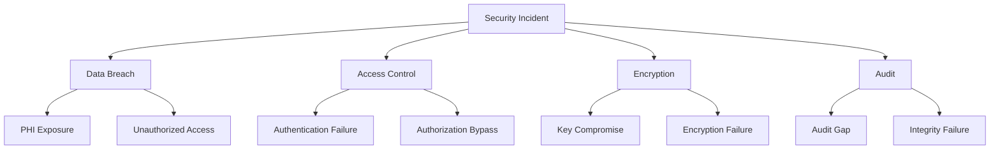
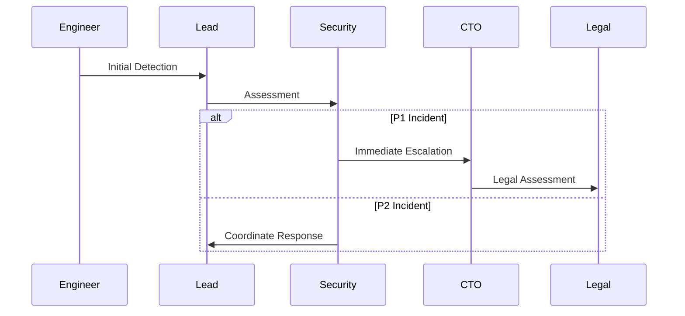

# Security Incident Response

This document outlines incident response procedures, building upon monitoring systems detailed in [Compliance Monitoring](../monitoring/COMPLIANCE_MONITORING.md).

## Incident Classification

### Severity Levels

```typescript
type IncidentSeverity = 'P1' | 'P2' | 'P3' | 'P4'

interface IncidentClassification {
  severity: IncidentSeverity
  responseTime: number        // minutes
  notificationPath: string[]
  updateFrequency: number    // minutes
}

const SEVERITY_MATRIX: Record<IncidentSeverity, IncidentClassification> = {
  P1: {
    severity: 'P1',
    responseTime: 15,
    notificationPath: ['Security-Team', 'CTO', 'Legal'],
    updateFrequency: 30
  },
  P2: {
    severity: 'P2',
    responseTime: 60,
    notificationPath: ['Security-Team', 'Engineering-Lead'],
    updateFrequency: 60
  },
  P3: {
    severity: 'P3',
    responseTime: 240,
    notificationPath: ['On-Call-Engineer'],
    updateFrequency: 240
  },
  P4: {
    severity: 'P4',
    responseTime: 1440,
    notificationPath: ['Security-Team'],
    updateFrequency: 1440
  }
}
```

### Incident Types



## Detection Mechanisms

### 1. Automated Detection

```typescript
interface DetectionRule {
  id: string
  type: 'PATTERN' | 'THRESHOLD' | 'ANOMALY'
  conditions: DetectionCondition[]
  severity: IncidentSeverity
  autoResponse?: AutoResponseAction[]
}

const DETECTION_RULES: DetectionRule[] = [
  {
    id: 'phi-mass-access',
    type: 'PATTERN',
    conditions: [{
      metric: 'phi.access.count',
      operator: 'GT',
      threshold: 100,
      timeWindow: 300000 // 5 minutes
    }],
    severity: 'P1',
    autoResponse: ['BLOCK_USER', 'NOTIFY_SECURITY']
  }
]
```

### 2. Manual Detection

```typescript
interface IncidentReport {
  reporter: {
    id: string
    role: string
    contact: string
  }
  observation: {
    timestamp: Date
    description: string
    evidence: string[]
  }
  initialAssessment: {
    severity: IncidentSeverity
    scope: string[]
    impact: string[]
  }
}
```

## Response Procedures

### 1. Initial Response

```typescript
async function initiateIncidentResponse(
  incident: SecurityIncident
): Promise<IncidentResponse> {
  // 1. Create incident record
  const response = await createIncidentRecord(incident)
  
  // 2. Notify required personnel
  await notifyTeam(response)
  
  // 3. Initial containment
  await executeContainment(response)
  
  // 4. Preserve evidence
  await preserveEvidence(response)
  
  // 5. Begin investigation
  await initiateInvestigation(response)
  
  return response
}
```

### 2. Containment Actions

```typescript
interface ContainmentAction {
  type: 'BLOCK' | 'REVOKE' | 'ISOLATE' | 'DISABLE'
  target: string
  scope: string[]
  duration: number
  approver?: string
}

const CONTAINMENT_PROCEDURES: Record<IncidentType, ContainmentAction[]> = {
  'PHI_EXPOSURE': [
    {
      type: 'REVOKE',
      target: 'USER_ACCESS',
      scope: ['PHI_DATA'],
      duration: 3600000 // 1 hour
    },
    {
      type: 'ISOLATE',
      target: 'AFFECTED_RECORDS',
      scope: ['ALL'],
      duration: 7200000 // 2 hours
    }
  ]
}
```

## Recovery Steps

### 1. Recovery Procedures

```typescript
interface RecoveryPlan {
  steps: RecoveryStep[]
  verification: VerificationStep[]
  rollback?: RollbackPlan
  approvals: string[]
}

interface RecoveryStep {
  order: number
  action: string
  validation: string
  timeout: number
  retry: {
    attempts: number
    backoff: number
  }
}

async function executeRecovery(
  incident: SecurityIncident,
  plan: RecoveryPlan
): Promise<RecoveryResult> {
  const results: StepResult[] = []
  
  for (const step of plan.steps) {
    const result = await executeRecoveryStep(step)
    results.push(result)
    
    if (!result.success) {
      await initiateRollback(plan.rollback)
      break
    }
  }
  
  return {
    success: results.every(r => r.success),
    steps: results,
    timestamp: new Date()
  }
}
```

### 2. System Verification

```typescript
interface SystemVerification {
  checks: VerificationCheck[]
  requirements: string[]
  evidence: string[]
}

const VERIFICATION_CHECKLIST = [
  'Tenant Isolation',
  'PHI Encryption',
  'Access Controls',
  'Audit Logging',
  'Backup Integrity'
]
```

## Communication Templates

### 1. Notification Templates

```typescript
interface IncidentNotification {
  template: string
  variables: Record<string, string>
  channels: NotificationChannel[]
  recipients: Recipient[]
  escalation?: EscalationPath
}

const NOTIFICATION_TEMPLATES = {
  'INITIAL_ALERT': `
Security Incident: {severity}
Time Detected: {timestamp}
Description: {description}
Initial Impact: {impact}
Required Actions: {actions}
Response Team: {team}
  `,
  'STATUS_UPDATE': `
Incident Update: {incidentId}
Current Status: {status}
Actions Taken: {actions}
Next Steps: {nextSteps}
Next Update In: {nextUpdate}
  `
}
```

### 2. Status Updates

```typescript
interface StatusUpdate {
  timestamp: Date
  status: 'INVESTIGATING' | 'CONTAINED' | 'RECOVERING' | 'RESOLVED'
  update: string
  metrics: {
    timeElapsed: number
    containmentStatus: number
    affectedUsers: number
  }
  nextUpdate: Date
}
```

## Escalation Paths

### 1. Escalation Flow



### 2. Escalation Rules

```typescript
interface EscalationRule {
  condition: string
  timeout: number
  path: string[]
  autoEscalate: boolean
}

const ESCALATION_RULES: EscalationRule[] = [
  {
    condition: 'NO_RESPONSE',
    timeout: 900000, // 15 minutes
    path: ['Lead', 'Security', 'CTO'],
    autoEscalate: true
  },
  {
    condition: 'CONTAINMENT_FAILED',
    timeout: 1800000, // 30 minutes
    path: ['Security', 'CTO', 'Legal'],
    autoEscalate: true
  }
]
```

## Related Documentation
- [Compliance Monitoring](../monitoring/COMPLIANCE_MONITORING.md)
- [Security Reports](../reporting/SECURITY_REPORTS.md)
- [Operations Runbook](../runbooks/OPERATIONS.md) 