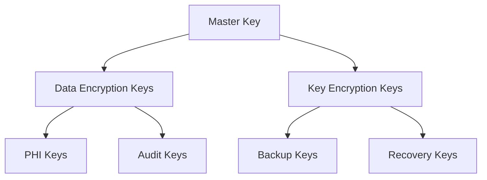

# Key Management Procedures

This document details the procedures for managing encryption keys in our HIPAA-compliant system. It builds upon the encryption system described in [PostgreSQL Security](./POSTGRESQL.md#encryption-functions).

## Key Hierarchy



## Key Generation

### Master Key Generation

```bash
#!/bin/bash
# generate-master-key.sh

# Generate master key using HSM
KEY_ID=$(aws kms create-key \
  --description "PHI Master Key" \
  --key-usage ENCRYPT_DECRYPT \
  --customer-master-key-spec SYMMETRIC_DEFAULT \
  --tags TagKey=Purpose,TagValue=PHI_PROTECTION \
  --output text --query 'KeyMetadata.KeyId')

# Create alias
aws kms create-alias \
  --alias-name alias/phi-master-key \
  --target-key-id $KEY_ID

echo "Master Key ID: $KEY_ID"
```

### Data Encryption Keys

```typescript
interface EncryptionKey {
  id: string
  version: number
  purpose: 'PHI' | 'AUDIT' | 'BACKUP'
  algorithm: 'AES-256-GCM' | 'AES-256-CBC'
  keyMaterial: Buffer
  createdAt: Date
  expiresAt: Date
  status: 'ACTIVE' | 'INACTIVE' | 'COMPROMISED'
}

async function generateDataKey(purpose: EncryptionKey['purpose']): Promise<EncryptionKey> {
  // Generate key using HSM
  const { Plaintext, CiphertextBlob } = await kms.generateDataKey({
    KeyId: process.env.MASTER_KEY_ID,
    KeySpec: 'AES_256'
  }).promise()

  // Store encrypted key
  const key = await prisma.encryptionKeys.create({
    data: {
      version: await getNextKeyVersion(),
      purpose,
      algorithm: 'AES-256-GCM',
      encryptedKey: CiphertextBlob,
      status: 'ACTIVE',
      expiresAt: new Date(Date.now() + 90 * 24 * 60 * 60 * 1000) // 90 days
    }
  })

  return {
    ...key,
    keyMaterial: Plaintext // Never stored, only in memory
  }
}
```

## Key Rotation

### Scheduled Rotation

```typescript
interface RotationConfig {
  schedule: string // cron expression
  gracePeriod: number // milliseconds
  concurrency: number
  retryAttempts: number
}

const PHI_KEY_ROTATION: RotationConfig = {
  schedule: '0 0 1 * *', // Monthly
  gracePeriod: 7 * 24 * 60 * 60 * 1000, // 7 days
  concurrency: 5,
  retryAttempts: 3
}

async function rotateKeys(config: RotationConfig): Promise<void> {
  // Generate new key
  const newKey = await generateDataKey('PHI')
  
  // Start re-encryption process
  const reEncryptionJob = await prisma.keyRotationJob.create({
    data: {
      keyId: newKey.id,
      status: 'IN_PROGRESS',
      config: config
    }
  })

  // Re-encrypt data in batches
  await reEncryptData(newKey.id, config)

  // Update key status
  await finalizeKeyRotation(newKey.id, reEncryptionJob.id)
}
```

### Emergency Rotation

```typescript
async function emergencyKeyRotation(
  compromisedKeyId: string,
  reason: string
): Promise<void> {
  // Log security incident
  const incident = await createSecurityIncident({
    type: 'KEY_COMPROMISE',
    severity: 'CRITICAL',
    details: { keyId: compromisedKeyId, reason }
  })

  // Generate new emergency key
  const emergencyKey = await generateDataKey('PHI')

  // Immediately mark old key as compromised
  await prisma.encryptionKeys.update({
    where: { id: compromisedKeyId },
    data: { status: 'COMPROMISED' }
  })

  // Start emergency re-encryption
  await emergencyReEncryption(compromisedKeyId, emergencyKey.id)

  // Notify security team
  await notifySecurityTeam(incident.id)
}
```

## Backup Procedures

### Key Backup

```typescript
interface KeyBackup {
  keyId: string
  encryptedKey: Buffer
  metadata: {
    version: number
    purpose: string
    algorithm: string
    hash: string
  }
  backupDate: Date
}

async function backupKey(keyId: string): Promise<void> {
  // Get key metadata
  const key = await prisma.encryptionKeys.findUnique({
    where: { id: keyId }
  })

  // Create backup bundle
  const backup: KeyBackup = {
    keyId: key.id,
    encryptedKey: key.encryptedKey,
    metadata: {
      version: key.version,
      purpose: key.purpose,
      algorithm: key.algorithm,
      hash: createKeyHash(key.encryptedKey)
    },
    backupDate: new Date()
  }

  // Store in secure backup location
  await storeKeyBackup(backup)

  // Log backup event
  await logAuditEvent({
    type: 'KEY_BACKUP',
    keyId: key.id,
    metadata: { backupId: backup.id }
  })
}
```

### Verification

```typescript
async function verifyKeyBackups(): Promise<void> {
  const backups = await listKeyBackups()
  
  for (const backup of backups) {
    // Verify backup integrity
    const isValid = await verifyBackupIntegrity(backup)
    
    // Test key recovery
    const canRecover = await testKeyRecovery(backup.keyId)
    
    // Log verification results
    await logBackupVerification({
      backupId: backup.id,
      isValid,
      canRecover
    })
  }
}
```

## Recovery Procedures

### Standard Recovery

```typescript
async function recoverKey(
  keyId: string,
  purpose: string
): Promise<EncryptionKey> {
  // Locate backup
  const backup = await findKeyBackup(keyId)
  
  // Verify backup integrity
  await verifyBackupIntegrity(backup)
  
  // Decrypt key using master key
  const recoveredKey = await decryptBackup(backup)
  
  // Verify key functionality
  await verifyKeyFunction(recoveredKey)
  
  return recoveredKey
}
```

### Emergency Access

```typescript
interface EmergencyAccess {
  requestId: string
  requester: {
    id: string
    role: string
    mfaVerified: boolean
  }
  reason: string
  approvers: string[]
  expiresAt: Date
}

async function requestEmergencyAccess(
  request: EmergencyAccess
): Promise<void> {
  // Create emergency request
  const accessRequest = await prisma.emergencyAccess.create({
    data: {
      requesterId: request.requester.id,
      reason: request.reason,
      status: 'PENDING_APPROVAL'
    }
  })

  // Notify approvers
  await notifyEmergencyApprovers(accessRequest.id)

  // Set up monitoring
  await monitorEmergencyAccess(accessRequest.id)
}

async function approveEmergencyAccess(
  requestId: string,
  approverId: string
): Promise<void> {
  // Verify approver authorization
  await verifyApproverAuth(approverId)

  // Grant temporary access
  const temporaryKey = await generateTemporaryKey()
  
  // Log emergency access
  await logEmergencyAccess({
    requestId,
    approverId,
    temporaryKeyId: temporaryKey.id
  })

  // Set up automatic revocation
  await scheduleAccessRevocation(temporaryKey.id)
}
```

## Monitoring and Alerts

```typescript
interface KeyAlert {
  type: 'EXPIRING' | 'COMPROMISED' | 'BACKUP_FAILED' | 'ROTATION_FAILED'
  keyId: string
  severity: 'HIGH' | 'CRITICAL'
  details: Record<string, any>
}

const KEY_MONITORING_CONFIG = {
  expirationWarning: 7 * 24 * 60 * 60 * 1000, // 7 days
  backupFrequency: 24 * 60 * 60 * 1000,      // 1 day
  verificationFrequency: 12 * 60 * 60 * 1000  // 12 hours
}
```

## Related Documentation
- [Security Architecture](./ARCHITECTURE.md)
- [PostgreSQL Security](./POSTGRESQL.md)
- [Operations Runbook](../runbooks/OPERATIONS.md) 