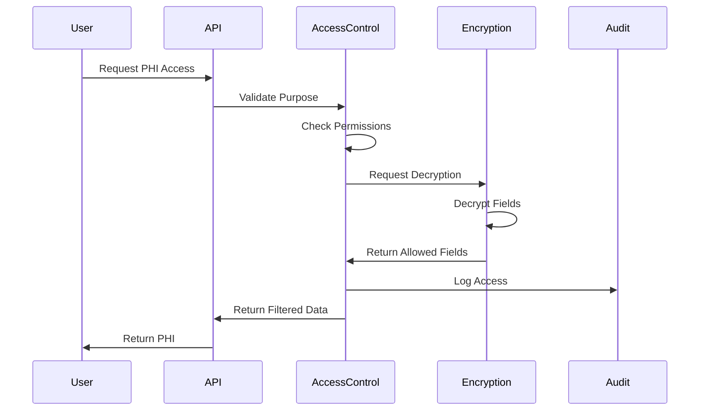
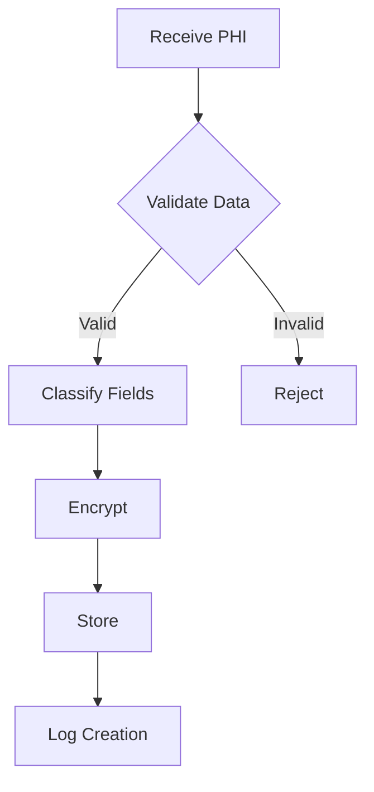

# Protected Health Information (PHI) Handling

This document details our PHI handling procedures and their HIPAA compliance mappings. It builds upon the encryption mechanisms detailed in [PostgreSQL Security](./POSTGRESQL.md).

## HIPAA Compliance Mapping

| Feature | HIPAA Requirement | Implementation |
|---------|------------------|----------------|
| Encryption | §164.312(a)(2)(iv) | AES-256 encryption with unique IVs |
| Access Control | §164.312(a)(1) | Role-based + Purpose-based access |
| Audit Trails | §164.312(b) | Comprehensive change + access logging |
| Data Integrity | §164.312(c)(1) | Checksums + version control |
| Person/Entity Authentication | §164.312(d) | MFA + session management |

## Data Classification

### PHI Fields
```typescript
interface PhiData {
  // Direct Identifiers (Extra Protected)
  patientId: string          // Encrypted + Searchable
  ssn?: string              // Encrypted Only
  mrn: string               // Encrypted + Searchable
  
  // Clinical Information (Protected)
  diagnosis: string         // Encrypted + Searchable
  treatment: {
    medications: string[]   // Encrypted
    procedures: string[]    // Encrypted
  }
  
  // Metadata (Non-PHI)
  lastUpdated: Date
  accessLevel: string
}
```

## Access Control Patterns

### Purpose-Based Access

```typescript
type AccessPurpose =
  | 'TREATMENT'           // Direct patient care
  | 'PAYMENT'            // Billing operations
  | 'OPERATIONS'         // Healthcare operations
  | 'RESEARCH'           // IRB-approved research
  | 'EMERGENCY'          // Break-glass scenario

interface PhiAccess {
  purpose: AccessPurpose
  scope: string[]         // Allowed fields
  expiration: Date
  auditRequirement: 'STANDARD' | 'ENHANCED'
}
```

### Access Flow


## Search Implementation

### Searchable Encryption
Building on the PostgreSQL encryption functions:

```typescript
interface SearchablePhiField {
  field: keyof PhiData
  searchType: 'EXACT' | 'PARTIAL' | 'PHONETIC'
  priority: number        // For ranking results
}

const SEARCHABLE_FIELDS: SearchablePhiField[] = [
  { field: 'patientId', searchType: 'EXACT', priority: 1 },
  { field: 'mrn', searchType: 'EXACT', priority: 1 },
  { field: 'diagnosis', searchType: 'PARTIAL', priority: 2 }
]
```

### Search Query Example
```typescript
async function searchPhi(
  query: string,
  purpose: AccessPurpose,
  options: SearchOptions
): Promise<SearchResult[]> {
  // Verify access purpose
  await verifyAccess(purpose)

  // Search with tenant isolation
  const results = await prisma.$queryRaw`
    SELECT * FROM search_phi(${query})
    WHERE tenant_id = ${getCurrentTenant()}
  `

  // Log search access
  await logPhiAccess({
    action: 'SEARCH',
    purpose,
    query,
    resultCount: results.length
  })

  return results
}
```

## Data Lifecycle Management

### 1. Creation


### 2. Access
- **Standard Access**: Through purpose-based authorization
- **Emergency Access**: Break-glass procedure with enhanced logging
- **Bulk Access**: Special authorization with mandatory audit
- **Research Access**: IRB approval required

### 3. Modification
```typescript
interface PhiModification {
  type: 'UPDATE' | 'REDACT' | 'ARCHIVE'
  fields: string[]
  purpose: AccessPurpose
  audit: {
    reason: string
    priorAuthorization?: string
  }
}
```

### 4. Retention
```typescript
const PHI_RETENTION_POLICIES = {
  ACTIVE: {
    duration: '6 years',
    archiveAfter: '2 years',
    requiresReview: true
  },
  ARCHIVED: {
    duration: '20 years',
    accessRestrictions: ['EMERGENCY', 'LEGAL'],
    encryptionRequirements: 'ENHANCED'
  }
}
```

### 5. Deletion
```typescript
async function securePhiDeletion(
  recordId: string,
  options: DeletionOptions
): Promise<DeletionResult> {
  return await prisma.$transaction(async (tx) => {
    // Secure overwrite of encryption keys
    await tx.encryptionKeys.update({
      where: { recordId },
      data: { keyValue: crypto.randomBytes(32) }
    })

    // Mark for deletion
    await tx.phiRecord.update({
      where: { id: recordId },
      data: { 
        status: 'PENDING_DELETION',
        deletionDate: new Date()
      }
    })

    // Log deletion intent
    await tx.auditLog.create({
      data: {
        action: 'DELETION_INITIATED',
        recordId,
        metadata: options
      }
    })
  })
}
```

## Monitoring and Compliance

### Access Pattern Analysis
```typescript
interface PhiAccessPattern {
  userId: string
  timeWindow: DateRange
  accessCount: number
  uniqueRecords: number
  purposes: AccessPurpose[]
  riskScore: number
}

const ANOMALY_THRESHOLDS = {
  MAX_DAILY_ACCESSES: 100,
  UNIQUE_RECORDS_RATIO: 0.8,
  PURPOSE_VARIETY_THRESHOLD: 3
}
```

### Compliance Reporting
See [Compliance Reporter](./POSTGRESQL.md#audit-logging-structure) for implementation details.

## Related Documentation
- [Security Architecture](./ARCHITECTURE.md)
- [PostgreSQL Security](./POSTGRESQL.md)
- [Incident Response](./incidents.md) 